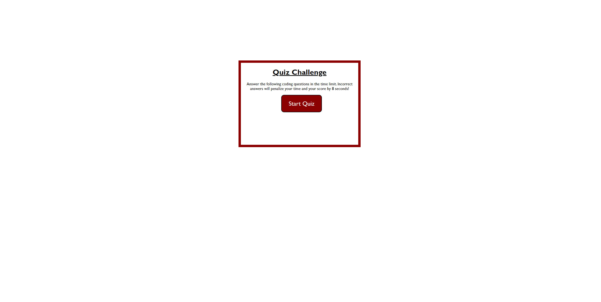

# module-4-challenge

### Description

*coded 2 html files, 2 javascript files, and a css file in order to create a coding quiz which has a timer
*the additional html and javascript files were created so that we can keep track of high scores
*css styling sheet customized the quiz and moved it so that it looks clean
*the timer goes off when you start the quiz, when you answer a questions wrong 8 seconds gets subtracted from final score
*at the end of the quiz, you can store high scores, then you can clear high scores and go back to the beginning of the quiz

### Screenshot

### Link

